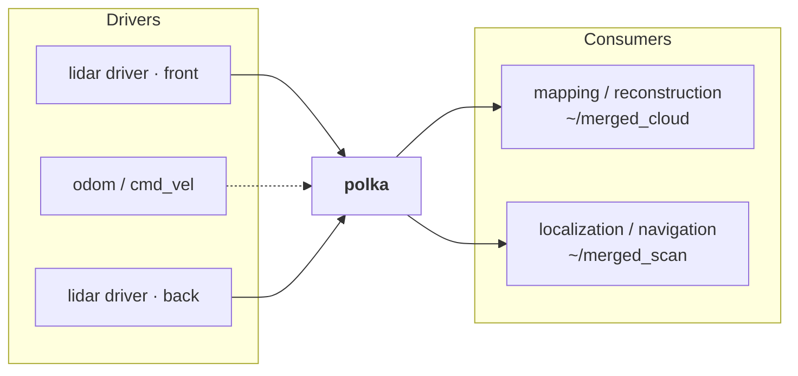
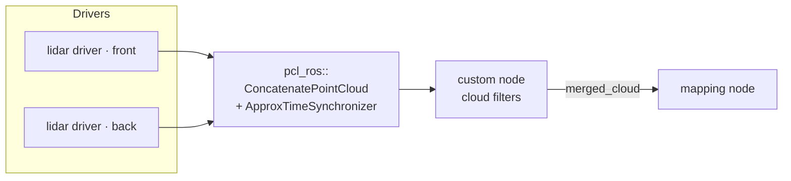
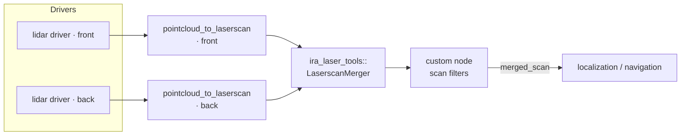
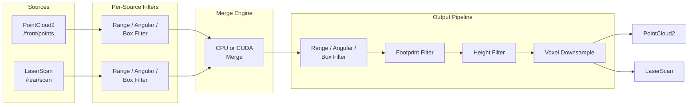

# POLKA

<p align="center">
  
</p>

**Multi-LiDAR fusion node for ROS 2** that merges any mix of PointCloud2 and LaserScan sources into a unified output, with optional CUDA GPU acceleration.

## Supported ROS 2 Distributions

| Distro | Ubuntu | Branch |
|--------|--------|--------|
| Humble | 22.04  | [`humble`](../../tree/humble) |
| Jazzy  | 24.04  | [`jazzy`](../../tree/jazzy) |

```bash
# Clone the branch matching your distro
git clone -b humble https://github.com/Pan-Navigator/polka.git  # Humble
git clone -b jazzy  https://github.com/Pan-Navigator/polka.git  # Jazzy
```

Polka replaces multi-node pipelines (relay -> filter -> transform -> merge -> downsample) with a single composable node, dramatically reducing latency, CPU overhead, and configuration complexity.

## Why Polka?

Managing multiple LiDAR sensors in ROS 2 typically requires a chain of separate nodes, each adding overhead, latency, and failure points. Polka collapses this entire pipeline into one composable node:

- **Deep per-source filtering**: every sensor gets its own range, angular, and box filter pass before any data enters the merge stage, so you never waste bandwidth merging garbage
- **Multi-modal merging**: fuse 3D PointCloud2 and 2D LaserScan sources together in a single merge step, no separate projection or relay nodes needed
- **Unified output**: emit merged PointCloud2, LaserScan, or both simultaneously from a single node
- **Rich output filtering**: after merge, apply range, angular, box, height filter, footprint filter (ego-body exclusion), and voxel downsampling in a defined, consistent order
- **CUDA GPU acceleration**: the merge engine can run entirely on GPU with fused kernels and pre-allocated buffers, cutting merge latency significantly on sensor-dense platforms
- **IMU-based deskewing**: per-point motion correction using the SE(3) exponential map removes intra-scan distortion, plus inter-source alignment eliminates ghosting artifacts during robot motion
- **TF2 integration**: transforms are resolved automatically, with fallback to the last known good transform so a momentary TF dropout does not drop the entire output

## Features

- **Heterogeneous source fusion**: mix 3D PointCloud2 and 2D LaserScan sensors freely
- **Dual output**: publish merged PointCloud2, LaserScan, or both simultaneously
- **Per-source filtering**: range, angular, and box filters applied before merge
- **Output filtering**: range, angular, box, height filter, footprint filter (ego-body exclusion), voxel downsampling
- **IMU-based deskewing**: per-point SE(3) motion correction using IMU angular velocity and acceleration, with auto-detection of per-point timestamp fields
- **CUDA acceleration**: optional GPU merge engine with fused kernels and pre-allocated buffers
- **TF2 integration**: automatic transform lookup with fallback to last known good transform
- **Fully parameterized**: every feature is runtime-configurable via ROS 2 parameters
- **Composable node**: runs standalone or loaded into a component container

## Dependencies

| Package | Purpose |
|---|---|
| `rclcpp` / `rclcpp_components` | ROS 2 node framework |
| `sensor_msgs` | PointCloud2, LaserScan messages |
| `sensor_msgs` (Imu) | IMU data for motion compensation / deskewing |
| `tf2_ros` / `tf2_eigen` | Frame transforms |
| `pcl_conversions` | PCL <-> ROS message conversion |
| `laser_geometry` | LaserScan -> PointCloud2 projection |
| CUDA toolkit | **Optional** -- only needed for GPU merge engine |

## Build

```bash
# CPU only
cd ~/ros2_ws
colcon build --packages-select polka

# With CUDA support
colcon build --packages-select polka --cmake-args -DWITH_CUDA=ON
```

## Quick Start

1. Copy and edit the example config:
   ```bash
   cp config/example_params.yaml config/my_robot.yaml
   ```

2. Set `output_frame_id` to your robot's base frame (e.g. `base_link`)

3. List your sensors under `source_names` and configure each source's topic, type, and filters

4. Ensure TF is published from each sensor's `frame_id` to `output_frame_id`

5. Launch:
   ```bash
   ros2 launch polka polka.launch.py config_file:=config/my_robot.yaml
   ```

## Configuration

All parameters live under the `polka` namespace. See [config/example_params.yaml](config/example_params.yaml) for the full annotated reference.

### Minimal Config

```yaml
polka:
  ros__parameters:
    output_frame_id: "base_link"
    output_rate: 20.0
    source_names: ["front_3d", "rear_2d"]
    sources:
      front_3d:
        topic: "/front_lidar/points"
        type: "pointcloud2"
      rear_2d:
        topic: "/rear_lidar/scan"
        type: "laserscan"
    outputs:
      cloud:
        enabled: true
      scan:
        enabled: true
```

Everything else has sensible defaults. Add filters, deskewing, and GPU acceleration as needed.

### Key Parameters

| Parameter | Default | Description |
|---|---|---|
| `output_frame_id` | `"base_link"` | Target frame for all merged output |
| `output_rate` | `20.0` | Merge + publish rate (Hz) |
| `source_timeout` | `0.5` | Drop source if no data within this window (s) |
| `enable_gpu` | `true` | Use CUDA merge engine when available (falls back to CPU) |
| `timestamp_strategy` | `"earliest"` | Output stamp: `earliest`, `latest`, `average`, or `local` |

### Per-Source Parameters

| Parameter | Default | Description |
|---|---|---|
| `sources.<name>.topic` | `""` | Subscription topic (required) |
| `sources.<name>.type` | `"pointcloud2"` | `"pointcloud2"` or `"laserscan"` |
| `sources.<name>.imu_topic` | `""` | Per-source IMU override (empty = use global) |
| `sources.<name>.qos_reliability` | `"best_effort"` | `"best_effort"` or `"reliable"` |
| `sources.<name>.qos_history_depth` | `1` | QoS queue depth |

### Motion Compensation (IMU Deskewing)

Corrects for robot motion during LiDAR scans using IMU data. Per-point deskewing uses the SE(3) exponential map motion model with angular velocity and linear acceleration from IMU, applied to each point based on its per-point timestamp. Inter-source alignment corrects for timing offsets between different sensors.

The motion model is inspired by [rko_lio](https://github.com/TixiaoShan/rko_lio) (Malladi et al., 2025).

```yaml
motion_compensation:
  enabled: true
  imu_topic: "/imu/data"          # sensor_msgs/Imu topic (global, used by all sources)
  max_imu_age: 0.2                # seconds - reject stale IMU
  imu_buffer_size: 200            # ring buffer (~1s at 200Hz)
  per_point_deskew: true          # per-point correction within each scan
  deskew_timestamp_field: "auto"  # auto-detects 'time', 't', 'timestamp', etc.
```

#### Per-Source IMU Override

Articulated platforms (hinged vehicles, manipulators, humanoids, rotating turrets) can override the IMU on a per-source basis: each moving sensor reads an IMU rigidly mounted to the moving body, while fixed sensors share the global platform IMU. polka uses TF to rotate both angular velocity and linear acceleration from the IMU frame into each sensor's frame, so `robot_state_publisher` must keep the IMU→sensor transform current — a dynamic transform (e.g. driven by joint_states from a turret encoder) works out of the box.

```yaml
motion_compensation:
  enabled: true
  imu_topic: "/imu/data"          # global fallback IMU

sources:
  turret_lidar:
    topic: "/turret/points"
    imu_topic: "/turret/imu/data" # per-source override
  chassis_lidar:
    topic: "/chassis/points"
    # imu_topic omitted — falls back to /imu/data
```

A working snippet with two sources is appended to [`config/example_params.yaml`](config/example_params.yaml) ("articulated platform" block). The global `motion_compensation.imu_topic` remains the recommended path for fully rigid platforms.

**Per-point timestamp auto-detect.** With `deskew_timestamp_field: "auto"` polka scans each `PointCloud2` for one of: `time`, `t`, `timestamp`, `time_stamp`, `offset_time`, `timeStamp`. Set a specific name if your driver uses something else; if no usable field is present polka logs once and falls back to whole-scan (non-per-point) deskewing for that source.

**Gravity subtraction.** Gravity is subtracted from `linear_acceleration` only when the IMU publishes a valid orientation: `orientation_covariance[0] >= 0` and a non-degenerate quaternion. Otherwise acceleration is zeroed and deskewing is rotation-only — still useful, but translation during the scan is not corrected.

### Output Filters

Applied to the merged cloud before publishing, in this order:

1. **Output filters** (range / angular / box)
2. **Footprint filter** -- removes points inside robot body exclusion zones
3. **Height filter** -- clips to `[z_min, z_max]`
4. **Voxel downsample** -- reduces density via VoxelGrid

```yaml
outputs:
  cloud:
    height_cap:
      enabled: true
      z_min: -1.0
      z_max: 3.0
    voxel:
      enabled: true
      leaf_size: 0.05
    self_filter:
      enabled: true
      box_names: ["chassis"]
      chassis:
        x_min: -0.30
        x_max:  0.30
        y_min: -0.25
        y_max:  0.25
        z_min: -0.10
        z_max:  0.50
```

## Pipeline Comparison

### polka (1 node)



### pcl_ros chain (7+ nodes)

Cloud path:



Scan path:



## Architecture



## File Structure

```
polka/
├── config/example_params.yaml      # Full annotated config reference
├── images/polka.png                # Project image
├── launch/polka.launch.py          # Launch file
├── include/polka/
│   ├── polka_node.hpp              # Main composable node
│   ├── types.hpp                   # Config structs and type definitions
│   ├── config_loader.hpp           # Parameter loading and hot-reload
│   ├── source_adapter.hpp          # Subscribes to and converts sensor data
│   ├── imu_buffer.hpp             # IMU ring buffer with atomic snapshot
│   ├── se3_exp.hpp                # SE(3) exponential map for motion compensation
│   ├── filters/
│   │   ├── i_filter.hpp            # Filter interface
│   │   ├── range_filter.hpp        # Min/max distance filter
│   │   ├── angular_filter.hpp      # Angular sector filter
│   │   └── box_filter.hpp          # Axis-aligned box filter (+ invert for self filter)
│   └── merge_engine/
│       ├── i_merge_engine.hpp      # Merge engine interface
│       ├── cpu_merge_engine.hpp    # CPU merge implementation
│       ├── cuda_merge_engine.hpp   # CUDA GPU merge implementation
│       └── cuda_types.cuh          # GPU type definitions
└── src/
    ├── main.cpp                    # Entry point
    ├── polka_node.cpp              # Node implementation
    ├── config_loader.cpp           # Parameter loading logic
    ├── source_adapter.cpp          # Source subscription logic
    ├── imu_buffer.cpp             # IMU buffer implementation
    ├── filters/                    # Filter implementations
    └── merge_engine/               # Merge engine implementations
```

## Acknowledgments

The per-point deskewing motion model (SE(3) exponential map with constant-acceleration + constant-angular-velocity) is inspired by rko_lio:

```bibtex
@article{malladi2025arxiv,
  author  = {M.V.R. Malladi and T. Guadagnino and L. Lobefaro and C. Stachniss},
  title   = {A Robust Approach for LiDAR-Inertial Odometry Without Sensor-Specific Modeling},
  journal = {arXiv preprint},
  year    = {2025},
  volume  = {arXiv:2509.06593},
  url     = {https://arxiv.org/pdf/2509.06593},
}
```

## License

Apache-2.0
