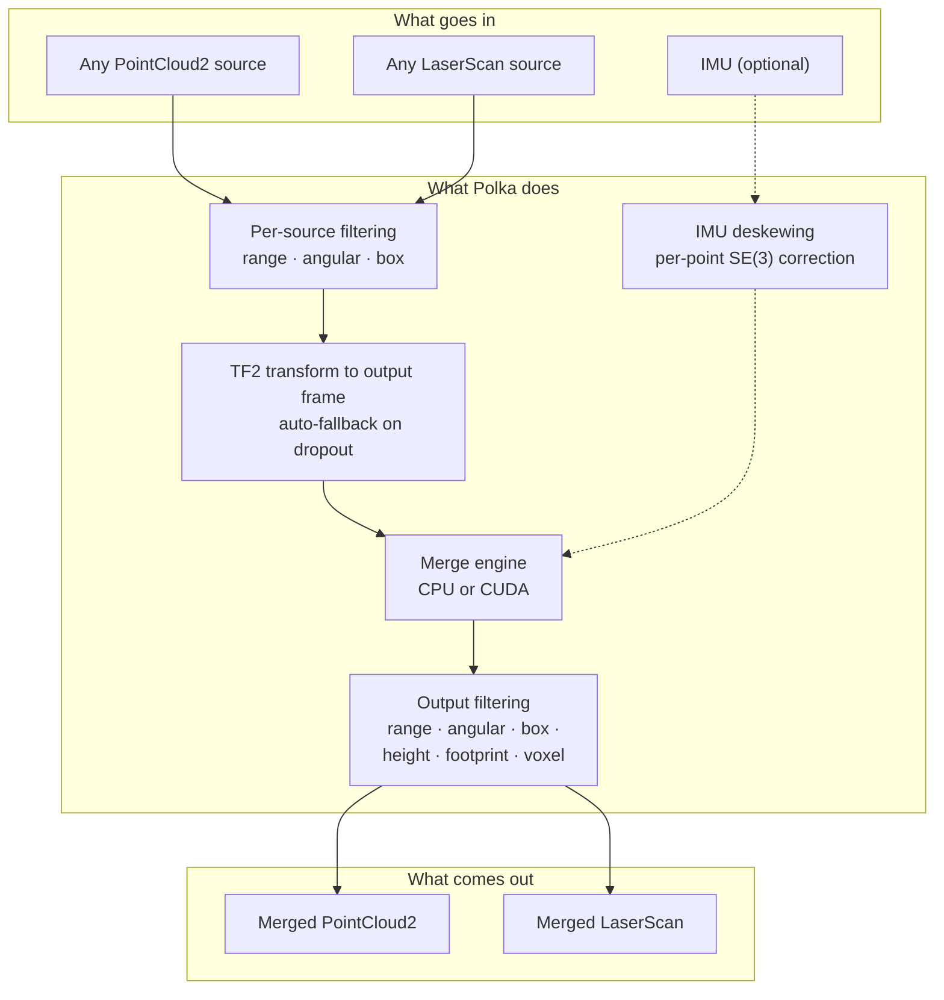
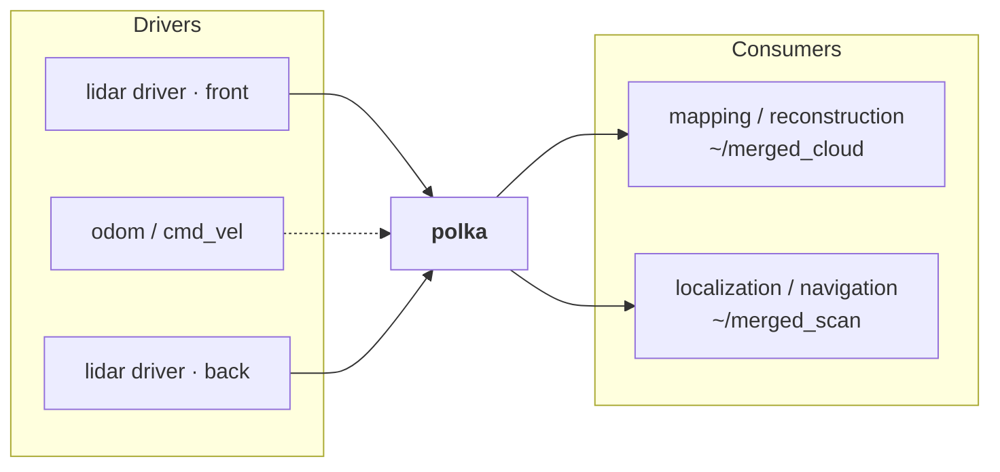
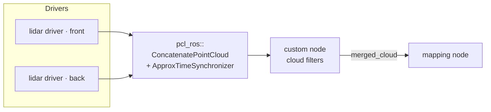
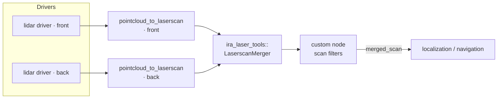

<p align="center">
  
</p>

**One node to fuse them all.** Polka merges any mix of PointCloud2 and LaserScan sources into unified output - with per-source filtering, IMU deskewing, and optional CUDA acceleration. It replaces the 7+ node `pcl_ros` / `ira_laser_tools` chains with a single composable ROS 2 node.

## Performance

```
┌──────────────────────────────────────────────────────────────────────┐
│                          POLKA BENCHMARK                             │
│  dual LiDAR · filtering + fusion + PointCloud2 & LaserScan output   │
├────────────────┬────────────────────┬────────────────────────────────┤
│                │  CPU only          │  CUDA (GPU)                    │
├────────────────┼────────────────────┼────────────────────────────────┤
│  Latency       │  45 ms             │  45 ms                        │
│  Compute load  │  12%               │  3%                           │
└────────────────┴────────────────────┴────────────────────────────────┘
```

Same latency, quarter the CPU cost on GPU. The CUDA path frees the Jetson's ARM cores for SLAM and navigation.

## Features



**Heterogeneous source fusion** - mix PointCloud2 and LaserScan sensors freely; Polka normalizes everything internally.

**Dual output** - publish merged PointCloud2, LaserScan, or both from the same pipeline. No need for a separate `pointcloud_to_laserscan` chain.

**Per-source filtering** - range, angular, and box filters run *before* merge, so you reject garbage early instead of burning cycles transforming and merging points you'll throw away.

**Output filter chain** - after merge, a fixed-order pipeline applies: range/angular/box → footprint exclusion (ego-body) → height band → voxel downsample. All stages independently toggleable.

**IMU deskewing** - per-point SE(3) motion correction using constant-acceleration + constant-angular-velocity model. Auto-detects per-point timestamp fields (`time`, `t`, `timestamp`, etc.). Inter-source alignment corrects timing offsets between sensors. Motion model inspired by [rko_lio](https://github.com/TixiaoShan/rko_lio) (Malladi et al., 2025).

**CUDA acceleration** - optional GPU merge engine with fused kernels and pre-allocated buffers. Falls back to CPU transparently if CUDA is unavailable.

**TF2 fallback** - automatic transform lookup with fallback to last known good on dropout. No crashes from momentary TF gaps.

**Composable node** - run standalone or load into a component container for zero-copy intra-process transport.

**Fully parameterized** - every feature is runtime-configurable via ROS 2 parameters.

## What it replaces

Polka collapses two parallel multi-node chains into one:

## Pipeline Comparison

### polka (1 node)



### pcl_ros chain (7+ nodes)

Cloud path:



Scan path:



Same functionality. One process. One config file.

## Quick start

```bash
cp config/example_params.yaml config/my_robot.yaml
# Edit: set output_frame_id, list sensors under source_names, configure per-source topics/filters
ros2 launch polka polka.launch.py params_file:=config/my_robot.yaml
```

Ensure TF is published from each sensor's `frame_id` to your `output_frame_id`.

## Build

```bash
# CPU only
colcon build --packages-select polka

# With CUDA
colcon build --packages-select polka --cmake-args -DPOLKA_ENABLE_CUDA=ON
```

## Configuration

All parameters live under the `polka` namespace. See [config/example_params.yaml](config/example_params.yaml) for the full annotated reference.

### Core parameters

| Parameter | Default | What it controls |
|---|---|---|
| `output_frame_id` | `"base_link"` | Target frame for merged output |
| `output_rate` | `20.0` | Merge + publish rate (Hz) |
| `source_timeout` | `0.5` | Drop source if silent for this long (s) |
| `timestamp_strategy` | `"earliest"` | Output stamp: `earliest`, `latest`, `average`, or `local` |

### Motion compensation (IMU deskewing)

Per-point deskewing applies the SE(3) exponential map with constant-acceleration + constant-angular-velocity per point based on its intra-scan timestamp.

```yaml
motion_compensation:
  enabled: true
  imu_topic: "/imu/data"
  max_imu_age: 0.2
  imu_buffer_size: 200            # ring buffer (~1s at 200Hz)
  per_point_deskew: true
  deskew_timestamp_field: "auto"  # auto-detects 'time', 't', 'timestamp', etc.
```

### Output filters

Applied after merge in fixed order: range/angular/box → footprint → height → voxel.

```yaml
outputs:
  cloud:
    height_filter:
      enabled: true
      z_min: -1.0
      z_max: 3.0
    voxel:
      enabled: true
      leaf_size: 0.05
    footprint_filter:
      enabled: true
      box_names: ["chassis"]
      chassis:
        x_min: -0.30
        x_max:  0.30
        y_min: -0.25
        y_max:  0.25
        z_min: -0.10
        z_max:  0.50
```

## Dependencies

| Package | Purpose |
|---|---|
| `rclcpp` / `rclcpp_components` | ROS 2 node framework |
| `sensor_msgs` | PointCloud2, LaserScan, Imu |
| `tf2_ros` / `tf2_eigen` | Frame transforms |
| `pcl_conversions` | PCL ↔ ROS message conversion |
| `laser_geometry` | LaserScan → PointCloud2 projection |
| CUDA toolkit | **Optional** - GPU merge engine only |

## File structure

```
polka/
├── config/example_params.yaml
├── launch/polka.launch.py
├── include/polka/
│   ├── polka_node.hpp              # Main composable node
│   ├── types.hpp                   # Config structs and type definitions
│   ├── config_loader.hpp           # Parameter loading and hot-reload
│   ├── source_adapter.hpp          # Sensor subscription and conversion
│   ├── filters/
│   │   ├── i_filter.hpp            # Filter interface
│   │   ├── range_filter.hpp
│   │   ├── angular_filter.hpp
│   │   └── box_filter.hpp          # Also used inverted for footprint filter
│   └── merge_engine/
│       ├── i_merge_engine.hpp      # Merge engine interface
│       ├── cpu_merge_engine.hpp
│       ├── cuda_merge_engine.hpp
│       └── cuda_types.cuh
└── src/
    ├── main.cpp
    ├── polka_node.cpp
    ├── config_loader.cpp
    ├── source_adapter.cpp
    ├── filters/
    └── merge_engine/
```

## Acknowledgments

Per-point deskewing motion model inspired by rko_lio:

```bibtex
@article{malladi2025arxiv,
  author  = {M.V.R. Malladi and T. Guadagnino and L. Lobefaro and C. Stachniss},
  title   = {A Robust Approach for LiDAR-Inertial Odometry Without Sensor-Specific Modeling},
  journal = {arXiv preprint},
  year    = {2025},
  volume  = {arXiv:2509.06593},
  url     = {https://arxiv.org/pdf/2509.06593},
}
```

## License

Apache-2.0
