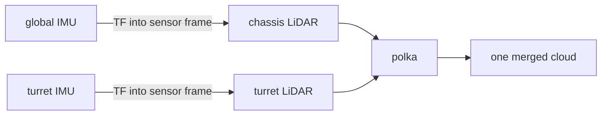

# POLKA

<p align="center">
  <a href="https://github.com/Pana1v/polka/tree/humble"></a>
  <a href="https://github.com/Pana1v/polka/tree/iron"></a>
  <a href="https://github.com/Pana1v/polka/tree/jazzy"></a>
  <a href="https://github.com/Pana1v/polka/tree/kilted"></a>
  <a href="https://github.com/Pana1v/polka/tree/lyrical"></a>
  <br/>
  
  
  
  <br/>
  
  
  
  
  <br/>
  <a href="LICENSE"></a>
  <a href="https://github.com/Pana1v/polka/stargazers"></a>
  <a href="https://github.com/Pana1v/polka/issues"></a>
  <a href="https://github.com/Pana1v/polka/commits"></a>
</p>

<p align="center">
  
  
  
  


</p>
  
**Multi-LiDAR fusion node for ROS 2.** Takes any mix of PointCloud2 and LaserScan sources and publishes one merged PointCloud2, one merged LaserScan, or both. Filters per source and on the output, deskews with IMU data, and uses CUDA if you build it in. One node instead of a relay, filter, transform, merge and downsample chain.

## Features in action

Each clip is polka with a different config, run on the [TIERS multi-LiDAR dataset](https://github.com/TIERS/multi_lidar_multi_uav_dataset) (Ouster OS1 + Livox Avia + Mid-360) and rendered headless with Open3D. [`doc/media/`](doc/media/) has the scripts to regenerate them.

<table>
<tr>
<td width="50%"><br/><em>Range filter: keep points within a distance shell</em></td>
<td width="50%"><br/><em>Angular filter: keep a yaw sector</em></td>
</tr>
<tr>
<td width="50%"><br/><em>Box filter: crop to an axis-aligned box</em></td>
<td width="50%"><br/><em>Height cap: clip to a z-range</em></td>
</tr>
<tr>
<td width="50%"><br/><em>Angular <code>invert</code> flag: keep vs. exclude a sector</em></td>
<td width="50%"><br/><em>Self-filter: remove the robot's own footprint</em></td>
</tr>
<tr>
<td width="50%"><br/><em>Voxel downsample: 69k to 5k points</em></td>
<td width="50%"><br/><em>Dual output: merged cloud plus flattened 2D scan</em></td>
</tr>
<tr>
<td colspan="2" align="center"><br/><em>2D LaserScan merge: each beam colored by the sensor with the nearest return</em></td>
</tr>
</table>

<p align="center">
  
  <br/>
  <em>Deskew: per-point SE(3) correction removes intra-scan motion smear. Synthetic yaw, generated separately from the TIERS clips above.</em>
</p>

## Performance

<p align="center">
  
</p>

**CUDA.** The GPU merge engine does transform, filter, voxel and scan flatten in one pass over the points, which pays off on heavy pipelines. On a filterless merge the CPU stays competitive — there is not enough per-point work to hide the kernel dispatch and the host-to-device copy. Build with `-DWITH_CUDA=ON` and it falls back to CPU on its own. It is not faster everywhere.

**Bandwidth.** polka turns N sensor streams into one topic, so downstream nodes subscribe once instead of once per sensor. Voxel downsampling thins that cloud further if you want it, by as much as you set with `leaf_size` — in the demo clip 69k points become 5k, but that is one leaf size, not a fixed ratio or a 0.5.0 speedup.

[Performance notes](doc/PERFORMANCE.md) covers where the numbers come from and when CUDA stops paying off.

## Features

- **Heterogeneous fusion**: mix 3D PointCloud2 and 2D LaserScan sources freely
- **Dual output**: merged PointCloud2, LaserScan, or both at once
- **Per-source and output filtering**: range, angular, box, height cap, footprint (ego-body) exclusion, voxel downsample
- **IMU deskewing**: per-point SE(3) motion correction, with per-point timestamp auto-detect
- **CUDA acceleration**: optional GPU merge engine, falls back to CPU
- **TF2 integration**: automatic lookup with last-known-good fallback
- **Runtime reconfiguration**: filters, outputs, deskewing and the source list all change live via `ros2 param set`, no restart
- **Diagnostics and a terminal dashboard**: per-source rate, bandwidth and lag on `/diagnostics`, drift flags, and an optional `polka_monitor` TUI
- **Composable node**: runs standalone or in a component container

## Sensor and IMU support

| Capability | Supported | How |
|---|---|---|
| 3D PointCloud2 | yes | native |
| 2D LaserScan | yes | projected and merged |
| Single global IMU | yes | `motion_compensation.imu_topic` |
| Multiple IMUs (per source) | yes | `sources.<name>.imu_topic` |
| Decentralized IMUs (different mounts) | yes | TF rotates angular velocity and acceleration into each sensor frame |
| Articulated IMUs (moving joint or turret) | yes | dynamic TF from `joint_states`; `config/example_articulated_imu.yaml` |

Every source can have its own IMU on its own mount. polka looks up the live TF from each IMU frame to its sensor frame and rotates that IMU's angular velocity and acceleration into the sensor frame before deskewing, so a fixed chassis LiDAR and a rotating turret LiDAR each deskew against the motion they actually see:


```mermaid
graph LR
  gimu[global IMU] -->|TF into sensor frame| chassis[chassis LiDAR]
  timu[turret IMU] -->|TF into sensor frame| turret[turret LiDAR]
  chassis --> polka
  turret --> polka
  polka --> merged[one merged cloud]
```

## Install

One branch per ROS 2 distro, same code on each:

| Distro | Ubuntu | Branch |
|--------|--------|--------|
| Humble | 22.04 | [`humble`](../../tree/humble) |
| Iron | 22.04 | [`iron`](../../tree/iron) |
| Jazzy | 24.04 | [`jazzy`](../../tree/jazzy) |
| Kilted | 24.04 | [`kilted`](../../tree/kilted) |
| Lyrical | 26.04 | [`lyrical`](../../tree/lyrical) |

```bash
git clone -b humble https://github.com/Pana1v/polka.git ~/ros2_ws/src/polka
cd ~/ros2_ws && colcon build --packages-select polka
# add  --cmake-args -DWITH_CUDA=ON  for the GPU merge engine
```

## Quick start

```bash
cp config/example_params.yaml config/my_robot.yaml      # edit topics + output_frame_id
ros2 launch polka polka.launch.py config_file:=config/my_robot.yaml
```

Point `output_frame_id` at your base frame, list your sensors under `source_names`, and check that TF resolves every sensor `frame_id` to `output_frame_id`. Playing a bag? Pass `use_sim_time:=true` and play with `--clock` (see [Configuration](doc/CONFIGURATION.md#rosbag--simulation-playback)).

## Documentation

- **[Configuration](doc/CONFIGURATION.md)**: every parameter, filters, IMU deskewing, bag playback
- **[Pipeline and architecture](doc/PIPELINE.md)**: what polka replaces, the internal stages, the file layout
- **[Performance](doc/PERFORMANCE.md)**: the 0.5.0 numbers, the CPU/CUDA crossover, bandwidth
- **[Maintaining distro branches](MAINTAINING.md)**: how the five branches stay in sync

## License and credits

Apache-2.0. The per-point deskewing motion model is inspired by [rko_lio](https://github.com/PRBonn/rko_lio) (Malladi et al., 2025, [arXiv:2509.06593](https://arxiv.org/pdf/2509.06593)).
