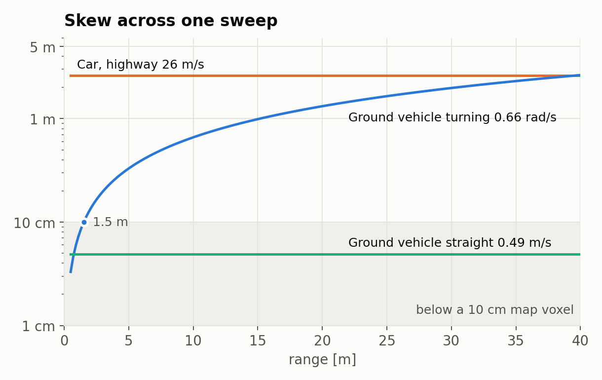
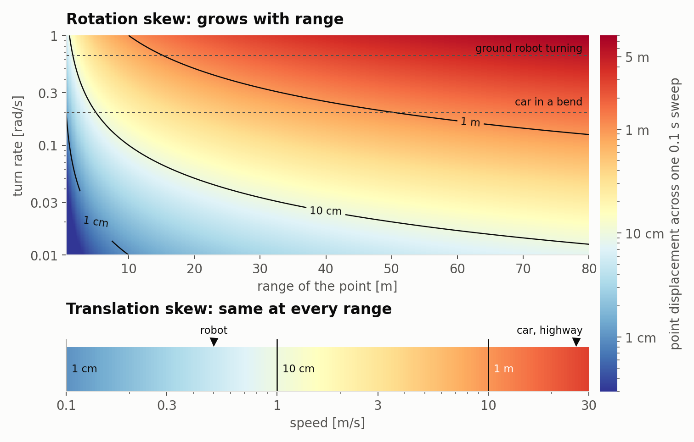
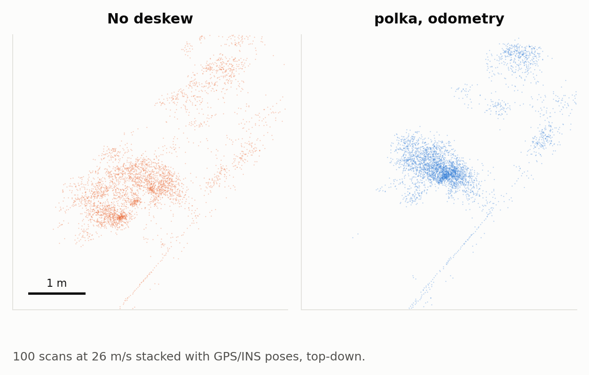
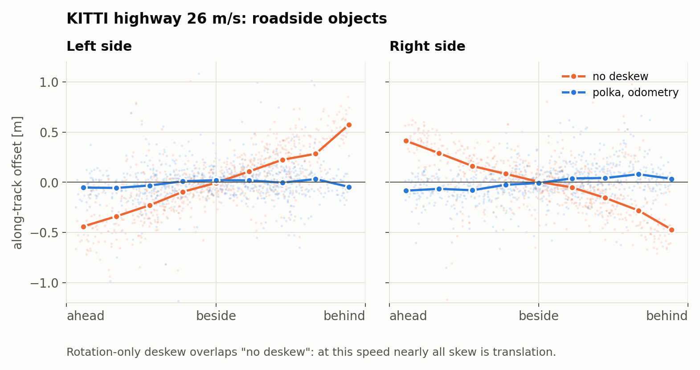

# Deskew

A LiDAR builds one scan over about 0.1 s. If the sensor moves meanwhile, every point is placed from wherever the sensor was when that point fired, and a rigid object smears across the scan. polka moves each point by the sensor's motion over its own time offset, so the whole scan reads as if taken at the header stamp. Parameters are in [Configuration](CONFIGURATION.md#motion-compensation-imu-deskewing).

## How big skew gets

  

Displacement across one 0.1 s sweep. Turning skew grows with range: at 0.66 rad/s it passes a 10 cm map voxel from 1.5 m out. Straight-line skew is the same at every range: 4.9 cm at 0.49 m/s, 2.6 m at 26 m/s. The ground-vehicle rates are the maxima of the articulated rig from [#2](https://github.com/Pana1v/polka/issues/2); the car is KITTI drive 0042 on a highway.

  

The same displacement for any turn rate, range and speed. Anything that turns needs rotation deskew. Anything fast needs translation too, which is what `motion_compensation.translation: odometry` adds.

## On real data: KITTI at 26 m/s

KITTI raw [2011_10_03_drive_0042](https://www.cvlibs.net/datasets/kitti/raw_data.php): an HDL-64 at 10 Hz, scans not deskewed, with OXTS GPS/INS for pose and twist. Point times come from azimuth. Two windows of 100 scans each; 78 compact roadside objects (poles, signs, bushes) tracked across every scan that saw them. In a skewed scan an object's position depends on when in the sweep it was caught, so it slides as the car passes. Deskew applies polka's motion model, the math of `source_adapter.cpp`, to the KITTI scans offline with OXTS velocity.

  

One roadside object, 100 scans stacked top-down with GPS/INS poses. Along-track spread: 0.48 m without deskew, 0.10 m with polka's `odometry` model.

  

Along-track offset of roadside objects as the car passes them. The two sides slope opposite ways: a clockwise sweep catches the left side early and the right side late.

| Window 1 / window 2 | Drift per scan | Spread per object (median std) |
|---|---|---|
| No deskew | −1.98 / −1.97 m | 26.5 / 21.3 cm |
| Rotation only (`translation: none`) | −2.00 / −1.95 m | 28.7 / 21.3 cm |
| `translation: odometry` | 0.08 / 0.40 m | 24.1 / 12.0 cm |

At highway speed nearly all skew is translation, so rotation-only deskew changes nothing.

## Cost

Deskew cost per point, and how it compares with GLIM, rko_lio and LIO-SAM, is in [Performance](PERFORMANCE.md).
