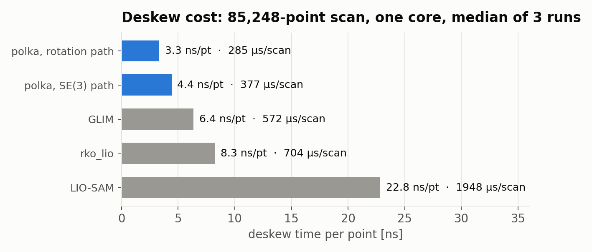

# Performance

Measured speedups, all on the CPU path.

| Change | Before | After | Factor |
|---|---|---|---|
| Deskew, rotation-only path (real IMU), per point | 41.2 ns | 3.3 ns | ~12x cheaper |
| Deskew, SE(3) path, per point | 41.2 ns | 4.4 ns | ~9x cheaper |
| CPU angular filter, per tick at 259k points | 10.47 ms | 3.55 ms | ~3x cheaper |

Deskew numbers: six public 85k-point RoboSense Airy clouds from the [#2](https://github.com/Pana1v/polka/issues/2) rig, 400 Hz IMU, one core, 300 repetitions, median of 3 runs. Both paths compute the exact transform at evenly spaced angles across each scan and step every point from the nearest one, so the cost is the same for any point order: spinning, vertically sweeping or unordered. Scan order, row-timed order and shuffled order all measure 3.3 / 4.4 ns per point. 0.5.0 listed a 6.2x deskew gain from a coarse stride, but that path only ran for IMU acceleration of exactly zero, which real IMUs never report, so it did not apply in practice until 0.6.0. The angular filter dropped its per-point `atan2` for a precomputed cross-product half-plane test.

Voxel downsampling is not in that table. It trades resolution for data volume rather than doing the same work faster — see bandwidth below.

## Deskew against other stacks

  

Same clouds, IMU and machine for every stack. Each one's deskew step is lifted from a fresh clone and timed alone, inputs copied outside the timer: [rko_lio 4b46678](https://github.com/PRBonn/rko_lio/commit/4b46678) (float build), [GLIM 2262aaf](https://github.com/koide3/glim/commit/2262aaf) (IMU preintegration and time-sorted points included), [LIO-SAM ros2 08af3f3](https://github.com/TixiaoShan/LIO-SAM/commit/08af3f3). This is the deskew step only, not whole-system speed: the other three deskew inside their odometry, polka upstream of it.

## Cheaper deskew is not straighter deskew

Two different claims get mixed up here.

The deskew speedups are cost numbers. They say the correction takes less time to compute, nothing more.

The quality side is separate. A LiDAR collects its points over a few tens of milliseconds, so if it rotates or translates during that sweep a rigid scan smears structure across the frame. Per-point SE(3) correction moves each point by the pose at its own timestamp and takes that smear out. [Deskew](DESKEW.md) measures how big the smear gets and what correction removes on public KITTI data. That is the quality claim; the tables here are the cost claim.

## CUDA is a crossover, not a free win

Built with `-DWITH_CUDA=ON`, polka runs the whole per-point path — transform, filter, voxel, scan flatten — as one fused GPU pass.

When a lot of points go through several filters, that pass wins. On a filterless merge it usually doesn't: there is too little per-point work to hide kernel dispatch and the host-to-device copy, so the CPU keeps up. It falls back to CPU automatically when built without CUDA or when no device is present.

No CUDA timings are published here. Measure it on your own pipeline.

## Bandwidth

Merging saves traffic regardless of how fast the merge itself runs.

- **N streams, one topic.** Downstream nodes subscribe once to the merged output instead of once per sensor. One frame, one QoS, one message to reason about.
- **Voxel downsampling.** Not a speedup — a resolution-for-bandwidth trade you set with `leaf_size`. At the leaf size used in the demo clip, 69k points come out as 5k. A bigger leaf thins more, a smaller one thins less.
- **Slimmer messages.** A per-point timestamp field costs 8 bytes on every point. Deskewing needs it on the input; if nothing downstream needs it, publishing without it saves 8 bytes times the point count.
