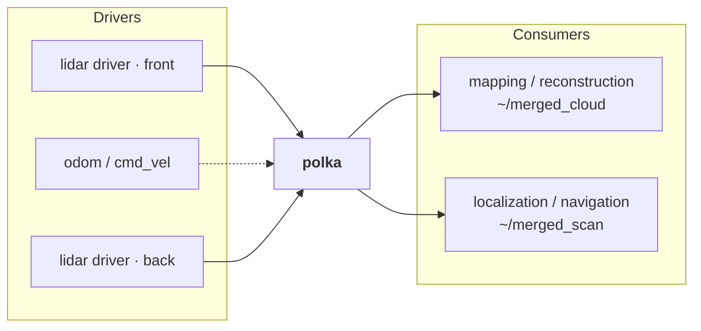
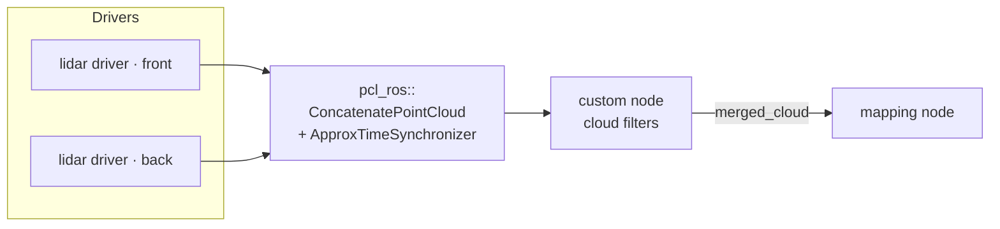
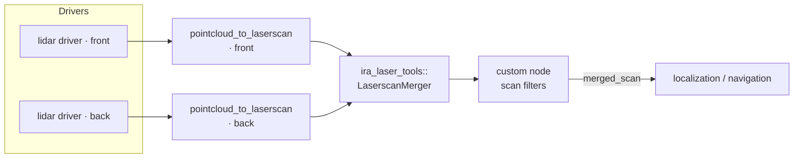
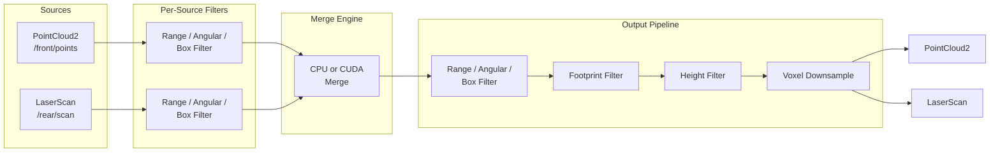

# Pipeline and architecture

Running several LiDARs in ROS 2 normally takes a chain of nodes: one to concatenate, one to filter, one per scan projection, another to merge those. Every hop costs latency and CPU, and every hop is one more thing to configure and one more thing that can die. polka does the whole chain in a single composable node.

## What polka replaces

### polka (1 node)



### pcl_ros chain (7+ nodes)

Cloud path:



Scan path:



## Internal stages



Each source is filtered in its own frame before the merge, so points you don't want are gone before they cost anything. The merge engine, CPU or CUDA, transforms every source into `output_frame_id` and concatenates. The output stage then runs the shared filters, height cap, footprint exclusion and voxel downsample in that fixed order, and publishes the cloud, the flattened scan, or both.

## File structure

```
polka/
├── config/
│   ├── example_params.yaml           # Minimal starting point
│   ├── detailed_params.yaml          # Annotated reference for every parameter
│   └── example_articulated_imu.yaml  # Per-source IMU deskewing example
├── launch/polka.launch.py            # Launch file
├── doc/                              # docs and assets
│   ├── CONFIGURATION.md
│   ├── PIPELINE.md
│   ├── images/polka.png              # logo
│   └── media/                        # demo GIFs (gifs/) + generator toolchain
├── include/polka/
│   ├── polka_node.hpp                # Main composable node (orchestration only)
│   ├── types.hpp                     # Config structs and type definitions
│   ├── config/config_loader.hpp      # Parameter loading and hot-reload
│   ├── input/
│   │   ├── source_adapter.hpp        # Subscribes and converts incoming sensor data
│   │   └── imu_buffer.hpp            # IMU ring buffer with atomic snapshot
│   ├── filters/
│   │   ├── i_filter.hpp              # Filter interface
│   │   ├── filter_chain.hpp          # Builds a filter chain from FilterParams
│   │   ├── range_filter.hpp          # Min/max distance filter
│   │   ├── angular_filter.hpp        # Angular sector filter
│   │   └── box_filter.hpp            # Axis-aligned box filter (invert for self filter)
│   ├── merge_engine/
│   │   ├── i_merge_engine.hpp        # Merge engine interface
│   │   ├── cpu_merge_engine.hpp      # CPU merge implementation
│   │   ├── cuda_merge_engine.hpp     # CUDA GPU merge implementation
│   │   └── cuda_types.cuh            # GPU type definitions
│   ├── output/
│   │   ├── output_pipeline.hpp       # Post-merge work (filter, height cap, voxel)
│   │   └── scan_builder.hpp          # Builds a LaserScan from a cloud or a range vector
│   └── util/
│       ├── qos_builder.hpp           # build_qos() for output publishers
│       ├── se3_exp.hpp               # SE(3) exponential map for motion compensation
│       └── log_format.hpp            # Log throttle constants
└── src/
    ├── main.cpp                      # Entry point
    ├── polka_node.cpp                # Node implementation
    ├── config_loader.cpp
    ├── source_adapter.cpp
    ├── imu_buffer.cpp
    ├── filters/                      # Filter implementations
    ├── merge_engine/                 # Merge engine implementations
    └── output/                       # OutputPipeline and ScanBuilder implementations
```
